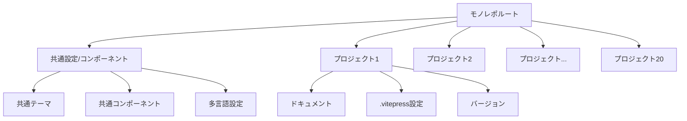

# VitePressモノレポドキュメントサイト実装計画

## 1. 全体アーキテクチャ



## 2. 技術スタック選定

### パッケージマネージャー: pnpm
モノレポ管理に最適なpnpmを推奨します。pnpmは以下の利点があります：
- ディスク容量の効率的な使用（同じパッケージの重複を避ける）
- ワークスペース機能が組み込まれている
- インストール速度が速い
- npmと互換性がある

### モノレポ管理: pnpm workspaces
pnpmのワークスペース機能を使用して、複数のVitePressプロジェクトを効率的に管理します。

### フレームワーク: VitePress
各プロジェクトでVitePressを使用し、共通設定を共有します。

### 検索機能: Algolia DocSearch または Flexsearch
- **Algolia DocSearch**: 強力な検索機能を提供（外部サービス）
- **Flexsearch**: クライアントサイドの検索ライブラリ（外部依存なし）

### CI/CD: GitHub Actions
GitHub Pagesへの自動デプロイを設定します。

## 3. ディレクトリ構造

```
docs/
├── package.json
├── pnpm-workspace.yaml
├── .github/
│   └── workflows/
│       └── deploy.yml
├── packages/
│   ├── shared/
│   │   ├── theme/
│   │   ├── components/
│   │   └── utils/
│   ├── project1/
│   │   ├── package.json
│   │   ├── .vitepress/
│   │   │   ├── config.js
│   │   │   └── theme/
│   │   ├── en/
│   │   │   ├── v1/
│   │   │   └── v2/
│   │   └── ja/
│   │       ├── v1/
│   │       └── v2/
│   ├── project2/
│   │   └── ...
│   └── ...
└── apps/
    └── main-site/
        ├── package.json
        ├── .vitepress/
        │   └── config.js
        └── index.md
```

## 4. 主要機能の実装方針

### 多言語対応
VitePressの多言語機能を活用し、各プロジェクトで言語ごとにディレクトリを分けます。

```javascript
// .vitepress/config.js
export default {
  locales: {
    '/': {
      lang: 'ja-JP',
      title: 'ドキュメント',
    },
    '/en/': {
      lang: 'en-US',
      title: 'Documentation',
    }
  }
}
```

### 横断的な検索機能
Algolia DocSearchを使用して、すべてのプロジェクトを横断的に検索できる機能を実装します。

```javascript
// .vitepress/config.js
export default {
  themeConfig: {
    algolia: {
      appId: 'YOUR_APP_ID',
      apiKey: 'YOUR_API_KEY',
      indexName: 'YOUR_INDEX_NAME'
    }
  }
}
```

### バージョン管理
各プロジェクトのドキュメントをバージョンごとにディレクトリで分けて管理します。

```
project1/
├── en/
│   ├── v1/
│   └── v2/
└── ja/
    ├── v1/
    └── v2/
```

### ナビゲーション
共通のナビゲーションコンポーネントを作成し、プロジェクト間の移動を容易にします。

## 5. デプロイ戦略

### GitHub Pages
GitHub Actionsを使用して、mainブランチへのプッシュ時に自動的にビルドとデプロイを行います。

```yaml
# .github/workflows/deploy.yml
name: Deploy to GitHub Pages

on:
  push:
    branches: [main]

jobs:
  build-and-deploy:
    runs-on: ubuntu-latest
    steps:
      - uses: actions/checkout@v3
      - uses: pnpm/action-setup@v2
        with:
          version: 8
      - uses: actions/setup-node@v3
        with:
          node-version: 18
          cache: 'pnpm'
      - run: pnpm install
      - run: pnpm build
      - uses: peaceiris/actions-gh-pages@v3
        with:
          github_token: ${{ secrets.GITHUB_TOKEN }}
          publish_dir: ./apps/main-site/.vitepress/dist
```

### Vercelオプション（代替案）
より高度な機能が必要な場合は、Vercelへのデプロイも検討できます。Vercelは以下の利点があります：
- サーバーサイド機能のサポート
- プレビュー環境の自動生成
- カスタムドメインの簡単な設定

## 6. 開発ワークフロー

1. 新しいプロジェクトの追加:
   ```bash
   pnpm create vitepress packages/new-project
   ```

2. 依存関係のインストール:
   ```bash
   pnpm install
   ```

3. 開発サーバーの起動:
   ```bash
   # 特定のプロジェクトの開発
   pnpm --filter project1 dev
   
   # メインサイトの開発
   pnpm --filter main-site dev
   ```

4. ビルド:
   ```bash
   pnpm build
   ```

## 7. 実装ステップ

1. プロジェクト初期化とpnpm workspacesの設定
2. 共通テーマとコンポーネントの作成
3. メインサイトの構築
4. 最初のプロジェクトの追加と設定
5. 多言語対応の実装
6. 検索機能の統合
7. バージョン管理システムの構築
8. CI/CDパイプラインの設定
9. 残りのプロジェクトの追加

## 8. 技術的な課題と解決策

### 課題1: 複数プロジェクト間での共通設定の共有
**解決策**: パッケージ化された共通設定モジュールを作成し、各プロジェクトから参照する

```javascript
// packages/shared/vitepress-config/index.js
export const baseConfig = {
  // 共通設定
};

// packages/project1/.vitepress/config.js
import { baseConfig } from '@docs/shared/vitepress-config';

export default {
  ...baseConfig,
  // プロジェクト固有の設定
};
```

### 課題2: 横断的な検索の実装
**解決策**: Algolia DocSearchを使用し、すべてのプロジェクトを一つのインデックスにクロールするよう設定

### 課題3: バージョン間のナビゲーション
**解決策**: カスタムコンポーネントを作成し、バージョン切り替えUIを実装

```vue
<!-- packages/shared/components/VersionSelector.vue -->
<template>
  <div class="version-selector">
    <select v-model="currentVersion" @change="switchVersion">
      <option v-for="version in versions" :key="version" :value="version">
        {{ version }}
      </option>
    </select>
  </div>
</template>
```

## 9. パフォーマンス最適化

1. **ビルド時間の短縮**:
   - インクリメンタルビルドの活用
   - 並列ビルドの設定

2. **ページロード速度の最適化**:
   - 画像の最適化
   - コンポーネントの遅延ロード
   - プリフェッチの設定

3. **検索パフォーマンスの向上**:
   - インデックスの最適化
   - 検索結果のキャッシュ

## 10. 将来の拡張性

1. **新しいプロジェクトの追加プロセス**:
   - テンプレートとスクリプトの作成
   - 自動設定の仕組み

2. **カスタムプラグインの開発**:
   - プロジェクト固有の機能拡張
   - 共通機能のプラグイン化

3. **分析と改善**:
   - 使用状況の追跡
   - フィードバックシステムの統合
